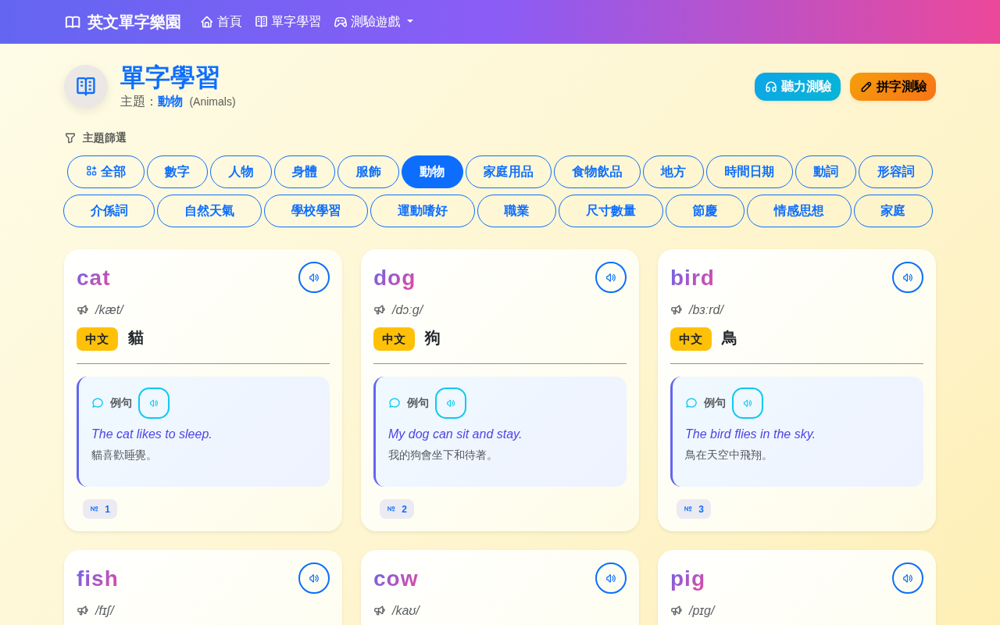
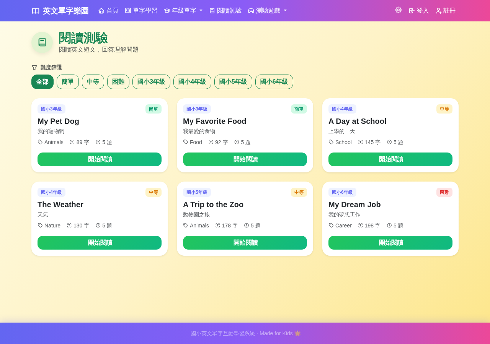
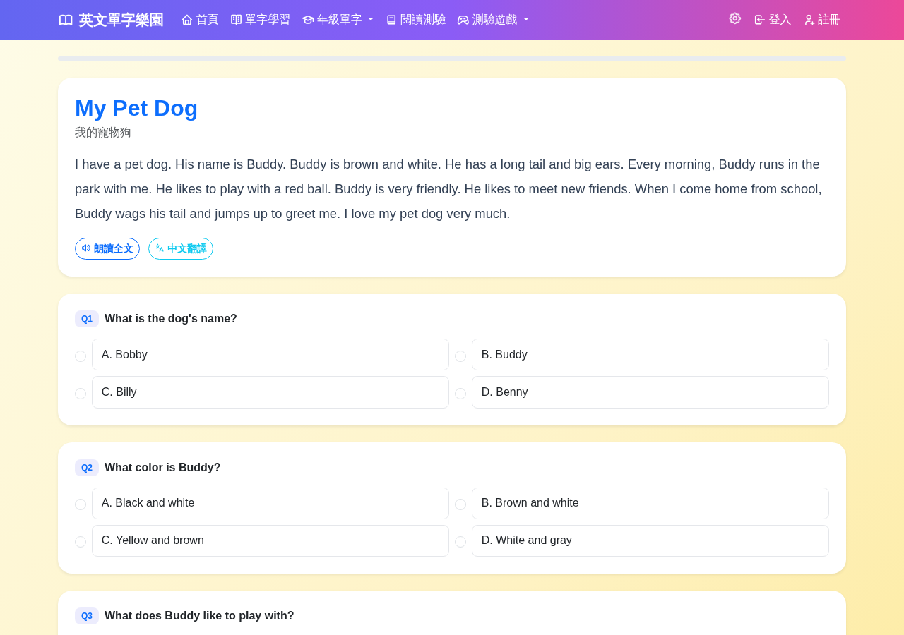

# 🌈 英文單字樂園（Primary English）

互動式國小英文單字學習系統，專為國小學童設計。透過**單字卡片**、**語音朗讀**、**AI 英文對話**、**聽力測驗**、**拼字測驗**、**閱讀理解**與**個人學習進度追蹤**，讓孩子輕鬆快樂地學英文！

全部 **2,125 個單字**整理自 [Prepedu 國小英文單字](https://prepedu.com/zh-hant/blog/elementary-english-vocabulary) 及 [景新國小單字王](https://www.jsps.ntpc.edu.tw/p/406-1000-7356,r35.php)（3~6 年級），涵蓋 24 個生活主題與年級分類。所有單字均包含 **KK 音標**、**英文例句**、**中文翻譯**。

線上環境：https://eng.yslifes.com

---

## ✨ 功能特色

### 📚 單字學習
- 依 **24 個主題分類**瀏覽單字卡片（數字、動物、食物、顏色、學校、家庭、運動、職業…）
- 每個單字包含：英文、中文翻譯、KK 音標、英文例句、中文翻譯
- 分類卡片附有主題圖片，視覺豐富
- 聲音播放：點擊 🔊 喇叭按鈕，用瀏覽器 Web Speech API 朗讀
- **🆕 TTS 語音設定面板**：
  - 語速調整（0.3x ~ 2.0x）
  - 音調調整（0.5 ~ 2.0）
  - 語音偏好（不限 / 女聲 / 男聲）
  - 設定自動儲存於瀏覽器 localStorage

### 🤖 AI 英文對話（🆕）
- 與 AI 進行國小程度的英文對話練習
- **依年級自動設定主題**：3 年級（基礎）、4 年級（學校生活）、5 年級（運動旅遊）、6 年級（科技環保）
- AI 會根據學生程度調整詞彙難度，引導使用已學單字
- 對話過程可查看中文提示，降低焦慮感

### 🎮 趣味測驗
| 測驗 | 玩法 |
|------|------|
| 🎧 **聽力測驗** | 聽到單字語音後，選出正確的中文意思 |
| ✏️ **拼字測驗** | 聽到單字語音後，輸入正確的英文拼字 |
| 📖 **閱讀理解** | 閱讀短文後回答 5 題選擇題 |
| 🏆 **即時回饋** | 答對/答錯有動畫與音效回饋 |
| 📊 **錯誤檢討** | 測驗結束顯示答錯單字，方便複習 |

### 👤 使用者帳號
- **註冊帳號**：輸入使用者名稱、密碼（最少 4 碼）、暱稱
- **登入**：密碼使用 BCrypt 加密儲存，不存明文
- **Session 記憶**：登入後自動記住，除非主動登出
- **個人學習儀表板**：
  - 📚 已學習單字數統計
  - 🎯 完成測驗次數
  - ⭐ 平均成績（綠/黃/紅 三色標記）
  - 📋 最近測驗紀錄列表

### 🛠 管理後台（登入者專用）
- **單字管理**：新增、編輯、刪除、搜尋、主題篩選單字
- **文章管理**：新增、編輯、刪除閱讀理解文章，可同時編輯 5 題選擇題
- **前台即時生效**：管理後台修改後，前台單字庫與閱讀測驗立即更新
- 僅限**已登入使用者**使用，未登入會自動導向登入頁

---

## 📸 畫面預覽

| 首頁主題總覽 | 單字卡片學習 |
|:---:|:---:|
|  |  |

| 聽力測驗 | 拼字測驗 |
|:---:|:---:|
|  |  |

| 閱讀列表 | 閱讀答題 |
|:---:|:---:|
|  |  |

| AI 對話 | 個人儀表板 |
|:---:|:---:|
|  |  |

> 管理後台入口位於登入後的右上角使用者選單中。

---

## 🎨 活潑畫面設計
- Bootstrap 5 + Tabler Icons（事件監聽使用 `addEventListener`，不使用 inline `onclick`）
- 紫→粉漸層導航列，圓角卡片 + 陰影
- 懸停放大動畫、閃爍星星、顏色漸層標籤
- 響應式設計，手機/平板/桌機都能使用

---

## 🛠 技術架構

| 層級 | 技術 |
|------|------|
| 後端 | Spring Boot 4.1 + Java 25 |
| 資料庫 | **SQLite**（檔案型，持久化儲存） |
| 資料遷移 | 自製 Flyway-compatible 遷移系統（`db/migration/V*.sql`） |
| ORM | Spring Data JPA + Hibernate SQLite Dialect |
| 安全性 | Spring Security（BCrypt 密碼加密，自訂登入頁面） |
| 前端 | Thymeleaf + Bootstrap 5 + Tabler Icons |
| 語音 | Web Speech API（瀏覽器原生） |
| AI 對話 | Ollama API（本地/遠端 LLM） |

---

## 🚀 快速啟動

### 1. 前置需求
- Java 25+
- Maven 3.9+
- SQLite（執行期自動使用，無需額外安裝）

### 2. 建置專案
```bash
mvn clean package -DskipTests
```

### 3. 啟動應用
```bash
java -jar target/primary-english-1.0.0.jar
```
> ⚠️ **請務必使用 `java -jar`，不要使用 `mvn spring-boot:run`**。後者會進入 DevTools 模式，可能導致靜態資源載入異常。

### 4. 開啟瀏覽器
```
http://localhost:8077/
```

### 5. 進入測驗
- 在單字學習頁點「聽力測驗」或「拼字測驗」
- 可按**主題**（數字、動物…）或**年級**（3~6年級）篩選題目
- 聽力測驗：播放英文 → 選中文
- 拼字測驗：聽中文 → 拼英文
- 不選分類則從全部 2,125 個單字隨機出題（最多 20 題）

> **注意**：第一次啟動會自動建立 SQLite 資料庫檔案於 `/tmp/primaryenglish.db`，並依序執行 `db/migration/V1__Initial_schema.sql`（建表 + 分類種子）與 `V2__Insert_vocabularies.sql`（2,125 筆單字）。

---

## 📂 專案結構

```
primary-english/
├── pom.xml
├── src/main/java/com/primaryenglish/
│   ├── PrimaryEnglishApplication.java
│   ├── config/
│   │   ├── SecurityConfig.java          # Spring Security 設定（自訂登入，無 formLogin）
│   │   ├── DataInitializer.java         # 啟動時執行遷移 + 初始化閱讀文章
│   │   ├── SQLiteFlywayMigration.java   # Flyway-compatible 遷移引擎
│   │   ├── FlywayMigrationConfig.java   # 遷移設定
│   │   ├── AiConfigResolver.java        # AI 模型設定解析
│   │   └── AiUserModelSelectionConfig.java # AI 使用者模型選擇開關
│   ├── entity/
│   │   ├── Category.java                # 分類
│   │   ├── Vocabulary.java              # 單字
│   │   ├── Article.java                 # 閱讀文章
│   │   ├── ReadingQuestion.java         # 閱讀題目
│   │   ├── User.java                    # 使用者
│   │   ├── UserVocabProgress.java       # 單字學習進度
│   │   └── QuizResult.java              # 測驗成績
│   ├── repository/
│   ├── service/
│   │   ├── UserService.java             # BCrypt 密碼處理
│   │   ├── ProgressService.java         # 學習進度
│   │   ├── QuizResultService.java       # 成績統計
│   │   └── AiConversationService.java   # AI 對話主題分配 + Prompt 生成
│   └── controller/
│       ├── HomeController.java
│       ├── VocabularyController.java
│       ├── QuizController.java
│       ├── ReadingController.java       # 閱讀測驗
│       ├── AdminController.java         # 管理後台
│       ├── UserController.java          # 登入/註冊/個人頁面
│       └── AiConversationController.java # AI 對話 API
├── src/main/resources/
│   ├── application.properties           # SQLite / AI / Session 設定
│   ├── db/migration/
│   │   ├── V1__Initial_schema.sql       # 建表 + 分類種子資料
│   │   └── V2__Insert_vocabularies.sql  # 2,125 筆單字（含音標、例句）
│   ├── static/
│   │   ├── css/
│   │   │   ├── custom.css               # 活潑樣式
│   │   │   ├── bootstrap.min.css          # 本機 Bootstrap
│   │   │   └── tabler-icons.min.css     # 本機 Tabler Icons
│   │   ├── js/
│   │   │   ├── main.js                  # 互動腳本
│   │   │   ├── speech.js                # Web Speech API
│   │   │   └── ai-conversation.js       # AI 對話前端邏輯
│   │   └── images/                      # 分類圖片
│   └── templates/
│       ├── fragments/
│       │   └── layout.html                # 共用佈局（有導航）
│       ├── index.html                     # 首頁/分類總覽
│       ├── vocabulary.html                # 單字卡片
│       ├── quiz-listen.html             # 聽力測驗
│       ├── quiz-spell.html              # 拼字測驗
│       ├── reading-list.html            # 閱讀列表
│       ├── reading-quiz.html            # 閱讀答題
│       ├── reading-result.html          # 閱讀結果
│       ├── ai-conversation.html         # AI 對話
│       ├── login.html                   # 登入
│       ├── register.html                # 註冊
│       ├── profile.html                 # 學習儀表板
│       └── admin/
│           ├── vocab-list.html            # 單字管理列表
│           ├── vocab-form.html            # 單字新增/編輯
│           ├── article-list.html          # 文章管理列表
│           └── article-form.html          # 文章新增/編輯
```

---

## 🗄 資料庫說明

- **SQLite**（非 H2），檔案位置：`/tmp/primaryenglish.db`
- **Schema 由遷移腳本管理**：`spring.jpa.hibernate.ddl-auto=none`
- 啟動時依序執行：
  1. `V1__Initial_schema.sql`：建立所有業務表 + 插入 24 個分類種子
  2. `V2__Insert_vocabularies.sql`：插入 2,125 筆單字（含音標、例句、年級）
  3. `DataInitializer.initArticles()`：插入 6 篇閱讀理解文章
- **使用者資料**（帳號/密碼雜湊/暱稱）自動保留在 SQLite 中

---

## 🗄 單字資料來源與統計

### 主題分類（Prepedu + 景新國小）

| # | 主題 | 單字數 |
|---|------|--------|
| 1 | 🔢 數字 | 10 |
| 2 | 👤 人物 | 10 |
| 3 | 🧍 身體 | 105 |
| 4 | 👕 服飾 | 110 |
| 5 | 🐾 動物 | 205 |
| 6 | 🏠 家庭用品 | 13 |
| 7 | 🍎 食物飲品 | 76 |
| 8 | 📍 地方 | 76 |
| 9 | ⏰ 時間日期 | 10 |
| 10 | 🏃 動詞 | 90 |
| 11 | ✨ 形容詞 | 10 |
| 12 | ⬆️ 介係詞 | 10 |
| 13 | 🌤️ 自然天氣 | 11 |
| 14 | 🎒 學校學習 | 133 |
| 15 | ⚽ 運動嗜好 | 3 |
| 16 | 💼 職業 | 228 |
| 17 | 📏 尺寸數量 | 10 |
| 18 | 🎂 節慶 | 10 |
| 19 | 😊 情感思想 | 68 |
| 20 | 👨‍👩‍👧‍👦 家庭 | 81 |
| 21 | 🎒 國小3年級 | 139 |
| 22 | 📚 國小4年級 | 137 |
| 23 | ✏️ 國小5年級 | 315 |
| 24 | 🎓 國小6年級 | 312 |

**總計 2,125 個單字**，全部包含：
- ✅ KK 音標（phonetic）
- ✅ 英文例句（example_en）
- ✅ 中文翻譯（example_cn）
- ✅ 年級標示（grade：3 / 4 / 5 / 6）

---

## 🤖 AI 對話設定

### 預設模型
- **Provider**：Ollama
- **Model**：`gemma4:31b-cloud`
- **Endpoint**：於 `application.properties` 設定 `ai.default-model.url`

### 年級對應主題
| 年級 | 主題範圍 |
|------|----------|
| 3 | 數字、顏色、動物、水果、家庭成員、基本動作 |
| 4 | 學校生活、食物飲料、交通工具、日常穿著、天氣季節 |
| 5 | 運動比賽、旅遊景點、節日活動、職業工作、健康身體 |
| 6 | 未來夢想、科技產品、環保議題、人際關係、國際文化 |

AI 會強制從對應年級的主題池中選擇，確保對話內容與學生年級相符。

---

## 🔊 語音播放說明

- 使用瀏覽器內建的 **Web Speech API**，無需 API Key
- 支援 Chrome、Edge、Safari、Firefox
- 語速已調為 **0.85 倍速**，適合國小學童

---

## 🧪 API 端點

| 方法 | 路徑 | 說明 |
|------|------|------|
| GET | `/api/vocabularies` | 所有單字（JSON） |
| GET | `/api/vocabularies?category={id}` | 依分類查詢 |
| GET | `/api/vocabularies/{id}` | 單字詳情 |
| POST | `/api/quiz/result` | 提交測驗結果 |
| POST | `/api/ai/conversation/start` | 開始 AI 對話 |
| POST | `/api/ai/conversation/continue` | 繼續 AI 對話 |

---

## 🚀 生產環境部署

### Cloudflare Tunnel
本專案使用 Cloudflare Tunnel 暴露服務，線上網址為 `https://eng.yslifes.com`。

### 部署步驟
```bash
# 1. 拉取最新程式碼
git pull origin main

# 2. 建置
mvn clean package -DskipTests

# 3. 停止舊程序
pkill -f "java.*primary-english"

# 4. 啟動（務必使用 java -jar，非 mvn spring-boot:run）
java -jar target/primary-english-1.0.0.jar > app.log 2>&1 &
```

### 重要提醒
- **必須使用 `java -jar`** 啟動，DevTools 模式會導致靜態資源 403
- 首次部署會自動建立 `/tmp/primaryenglish.db` 並執行 V1 + V2 遷移
- 若要重置單字資料，刪除 `/tmp/primaryenglish.db` 後重啟即可

---

## ⚠️ 安全性注意事項

1. **生產環境請修改密碼規則**
   - 目前密碼最少 4 碼（方便兒童記憶）
   - 上線建議改為最少 6-8 碼

2. **SQLite 檔案位置**
   - 資料庫檔案位於 `/tmp/primaryenglish.db`
   - 生產環境建議改為 persistent 路徑（如 `./data/primaryenglish.db`）
   - 修改 `application.properties` 中的 `spring.datasource.url`

3. **Spring Security**
   - 已移除 `formLogin()`，使用自訂登入控制器
   - 靜態資源（`/js/**`、`/css/**`、`/images/**`）允許匿名存取

4. **HTTPS**
   - 本地開發使用 HTTP
   - 線上透過 Cloudflare Tunnel 自動啟用 HTTPS

---

## 📝 開發注意事項

- **無需安裝資料庫**：SQLite 為檔案型，自動建立
- **無需 Node/npm**：前端使用 Thymeleaf + 靜態 CSS，無需建置
- **圖片資源**：分類圖片位於 `static/images/`，部分分類有圖片，部分用 Tabler Icons
- **熱部署**：`spring-boot-devtools` 已加入，開發時自動重新載入（僅開發模式）
- **資料遷移**：新增 schema 變更時，請在 `db/migration/` 新增 `V{version}__Description.sql`

---

## 📄 授權

本專案單字內容整理自 [Prepedu 國小英文單字](https://prepedu.com/zh-hant/blog/elementary-english-vocabulary) 與 [景新國小單字王](https://www.jsps.ntpc.edu.tw/p/406-1000-7356,r35.php)，僅供教育用途使用。

---

Made for Kids 🌟 · 國小英文單字互動學習系統
